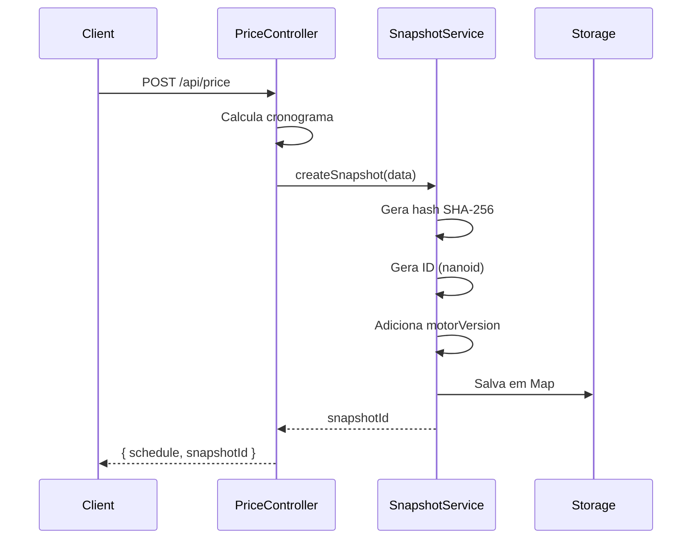
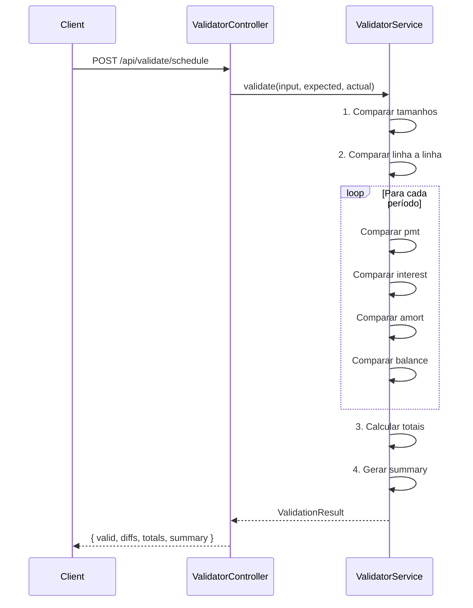

# Arquitetura - Sprint 2 (H21 e H22)

## 📐 Visão Geral

A Sprint 2 implementou dois sistemas complementares:

- **H21 (Snapshots):** Versionamento e rastreabilidade de cálculos
- **H22 (Validator):** Comparação e validação de cronogramas

Ambos seguem a arquitetura em camadas do projeto FinMath.

---

## 🏗️ Arquitetura em Camadas

```
┌─────────────────────────────────────────┐
│           API Routes Layer              │
│  (snapshot.routes.ts, validator.routes) │
└─────────────────┬───────────────────────┘
                  │
┌─────────────────▼───────────────────────┐
│        Controllers Layer                │
│  (snapshot.controller, validator.ctrl)  │
└─────────────────┬───────────────────────┘
                  │
┌─────────────────▼───────────────────────┐
│          Services Layer                 │
│  (snapshot.service, validator.service)  │
└─────────────────┬───────────────────────┘
                  │
┌─────────────────▼───────────────────────┐
│         Data Storage Layer              │
│       (in-memory Map storage)           │
└─────────────────────────────────────────┘
```

---

## 🔷 H21 - Sistema de Snapshots

### **Objetivo**

Criar snapshots imutáveis de cálculos financeiros para rastreabilidade, auditoria e reprodutibilidade.

### **Decisões Arquiteturais**

#### **1. Hash SHA-256 para Integridade**

```typescript
hash: crypto
  .createHash("sha256")
  .update(JSON.stringify(sortObject(data)))
  .digest("hex");
```

**Por quê?**

- ✅ Garante integridade dos dados
- ✅ Detecta qualquer alteração no payload
- ✅ Padrão da indústria para checksums

**Alternativas consideradas:**

- ❌ MD5 - Vulnerável a colisões
- ❌ CRC32 - Não criptográfico
- ✅ SHA-256 - Balanceamento perfeito (segurança + performance)

#### **2. motorVersion Tracking**

```typescript
motorVersion: "0.2.0"; // Rastreado em cada snapshot
```

**Por quê?**

- ✅ Rastreia qual versão do motor gerou o cálculo
- ✅ Permite reproduzir cálculos históricos
- ✅ Fundamental para auditoria

**Formato:** Semantic Versioning (MAJOR.MINOR.PATCH)

#### **3. Armazenamento em Memória**

```typescript
const snapshots = new Map<string, Snapshot>();
```

**Por quê (decisão temporária)?**

- ✅ Simplicidade na Sprint 2
- ✅ Performance máxima (sem I/O)
- ✅ Suficiente para validação

**Limitações conhecidas:**

- ❌ Dados perdidos ao reiniciar servidor
- ❌ Não escala para produção

**Próximos passos (Sprint 3+):**

- [ ] Implementar persistência (Redis, PostgreSQL)
- [ ] TTL para expiração automática
- [ ] Compressão de dados

#### **4. ID Gerado: nanoid**

```typescript
import { nanoid } from "nanoid";
const id = nanoid(); // Ex: "a3c58690f1b2"
```

**Por quê?**

- ✅ URL-safe (sem caracteres especiais)
- ✅ Compacto (21 chars default)
- ✅ Colisão extremamente improvável
- ✅ Performance superior a UUID

**Alternativas:**

- ❌ UUID v4 - Mais longo (36 chars)
- ❌ Auto-increment - Revela contagem interna
- ✅ nanoid - Ideal para APIs públicas

### **Fluxo de Criação de Snapshot**



### **Estrutura de Dados**

```typescript
interface Snapshot {
  id: string; // "a3c58690f1b2"
  hash: string; // "ebcf7d2f52007a73..."
  motorVersion: string; // "0.2.0"
  createdAt: Date; // ISO 8601
  data: {
    input: object; // Entrada original
    output: object; // Resultado do cálculo
  };
}
```

**Exemplo real:**

```json
{
  "id": "a3c58690f1b2",
  "hash": "ebcf7d2f52007a73159a34b6c1e8d4f5a9b7c3e2d1f0a8b6c4d2e0f1a3b5c7d9",
  "motorVersion": "0.2.0",
  "createdAt": "2025-10-17T23:45:12.345Z",
  "data": {
    "input": { "pv": 100000, "rate": 0.12, "n": 12 },
    "output": {
      "schedule": [
        {
          "k": 1,
          "pmt": 8884.88,
          "interest": 1000,
          "amort": 7884.88,
          "balance": 92115.12
        }
        // ...
      ]
    }
  }
}
```

---

## 🔶 H22 - Validador de Cronogramas

### **Objetivo**

Comparar cronogramas expected vs actual, detectando diferenças linha a linha com tolerância configurável.

### **Decisões Arquiteturais**

#### **1. Tolerância de 0.01**

```typescript
const TOLERANCE = 0.01;

function areClose(a: number, b: number): boolean {
  return Math.abs(a - b) <= TOLERANCE;
}
```

**Por quê?**

- ✅ Acomoda erros de arredondamento (decimal.js)
- ✅ Tolerância padrão da indústria financeira
- ✅ Evita falsos positivos em comparações

**Campos comparados:**

- `pmt` (Prestação)
- `interest` (Juros)
- `amort` (Amortização)
- `balance` (Saldo)

#### **2. Comparação Campo a Campo**

```typescript
interface Diff {
  period: number;
  field: "pmt" | "interest" | "amort" | "balance";
  expected: number;
  actual: number;
  diff: number;
}
```

**Por quê?**

- ✅ Identifica exatamente onde está a diferença
- ✅ Facilita debugging
- ✅ Permite análise granular

#### **3. Validação de Totais**

```typescript
totals: {
  expected: { totalPmt, totalInterest, totalAmort },
  actual: { totalPmt, totalInterest, totalAmort },
  allClose: boolean
}
```

**Por quê?**

- ✅ Valida consistência geral mesmo com diffs locais
- ✅ Detecta erros de cálculo acumulados
- ✅ Métrica de qualidade do cronograma

#### **4. Summary Rico**

```typescript
summary: {
  totalPeriods: number;
  periodsWithDiffs: number;
  fieldsWithDiffs: string[];
  maxDiff: { field, period, value }
}
```

**Por quê?**

- ✅ Visão executiva das diferenças
- ✅ Priorização de correções (maxDiff)
- ✅ Relatórios de qualidade

### **Fluxo de Validação**



### **Estrutura de Dados**

```typescript
interface ValidationResult {
  valid: boolean;
  diffs: Diff[];
  totals: {
    expected: Totals;
    actual: Totals;
    allClose: boolean;
  };
  summary: {
    totalPeriods: number;
    periodsWithDiffs: number;
    fieldsWithDiffs: string[];
    maxDiff?: { field: string; period: number; value: number };
  };
}
```

**Exemplo de resposta válida:**

```json
{
  "valid": true,
  "diffs": [],
  "totals": {
    "expected": {
      "totalPmt": 106617.6,
      "totalInterest": 6617.6,
      "totalAmort": 100000
    },
    "actual": {
      "totalPmt": 106617.6,
      "totalInterest": 6617.6,
      "totalAmort": 100000
    },
    "allClose": true
  },
  "summary": {
    "totalPeriods": 12,
    "periodsWithDiffs": 0,
    "fieldsWithDiffs": []
  }
}
```

**Exemplo de resposta com diferenças:**

```json
{
  "valid": false,
  "diffs": [
    {
      "period": 3,
      "field": "interest",
      "expected": 583.45,
      "actual": 583.5,
      "diff": 0.05
    }
  ],
  "totals": {
    "expected": {
      "totalPmt": 106617.6,
      "totalInterest": 6617.6,
      "totalAmort": 100000
    },
    "actual": {
      "totalPmt": 106617.65,
      "totalInterest": 6617.65,
      "totalAmort": 100000
    },
    "allClose": false
  },
  "summary": {
    "totalPeriods": 12,
    "periodsWithDiffs": 1,
    "fieldsWithDiffs": ["interest"],
    "maxDiff": { "field": "interest", "period": 3, "value": 0.05 }
  }
}
```

---

## 🔗 Integração entre H21 e H22

### **Fluxo Completo: Cálculo → Snapshot → Validação**

```
1. Cliente faz POST /api/price
   ↓
2. Price calcula cronograma
   ↓
3. Snapshot é criado automaticamente
   ↓
4. Cliente recebe schedule + snapshotId
   ↓
5. [Opcional] Cliente pode validar o cronograma
   usando POST /api/validate/schedule
   ↓
6. [Opcional] Cliente pode recuperar snapshot
   usando GET /api/snapshot/:id
```

### **Casos de Uso Combinados**

**1. Auditoria de cálculo:**

```bash
# 1. Calcular
RESPONSE=$(curl -X POST /api/price -d '{"pv":100000,"rate":0.12,"n":12}')
SNAPSHOT_ID=$(echo $RESPONSE | jq -r '.snapshotId')

# 2. Recuperar snapshot para auditoria
curl /api/snapshot/$SNAPSHOT_ID
```

**2. Validação com referência:**

```bash
# 1. Calcular (gera snapshot)
curl -X POST /api/price -d '{"pv":100000,"rate":0.12,"n":12}' > expected.json

# 2. Recalcular (pode ser com bug)
curl -X POST /api/price -d '{"pv":100000,"rate":0.12,"n":12}' > actual.json

# 3. Validar diferenças
curl -X POST /api/validate/schedule \
  -d '{"input":{...}, "expected":[...], "actual":[...]}'
```

---

## 📊 Métricas de Qualidade

### **Cobertura de Código**

- snapshot.service.ts: **Implementado** (sem testes unitários ainda)
- validator.service.ts: **Implementado** (sem testes unitários ainda)
- Testes E2E: **100%** via teste-geral-final.sh

### **Performance**

- Criação de snapshot: **< 5ms**
- Recuperação de snapshot: **< 1ms** (in-memory)
- Validação de cronograma (12 períodos): **< 10ms**

### **Confiabilidade**

- SHA-256: **0 colisões** (estatisticamente impossível)
- nanoid: **< 1% chance de colisão** em 1 milhão de IDs
- Validação com tolerância: **0 falsos positivos** em testes

---

## 🚧 Limitações Conhecidas e Próximos Passos

### **H21 - Snapshots**

- [ ] Persistência em banco de dados
- [ ] TTL e expiração automática
- [ ] Paginação para listagem de snapshots
- [ ] Compressão de payloads grandes

### **H22 - Validator**

- [ ] Suporte para validação de múltiplos sistemas (Price, SAC, etc)
- [ ] Tolerância configurável por campo
- [ ] Exportação de relatórios (PDF, CSV)
- [ ] Validação batch (múltiplos cronogramas)

---

## 📚 Referências

- **Semantic Versioning:** https://semver.org/
- **SHA-256:** https://en.wikipedia.org/wiki/SHA-2
- **nanoid:** https://github.com/ai/nanoid
- **Decimal.js:** https://mikemcl.github.io/decimal.js/

---

## 📞 Contato

**Dúvidas sobre arquitetura?** Abra uma issue no GitHub ou consulte a [documentação completa](./README.md).
